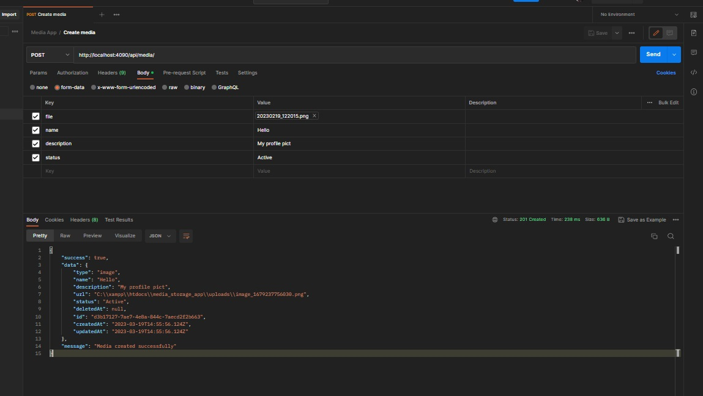
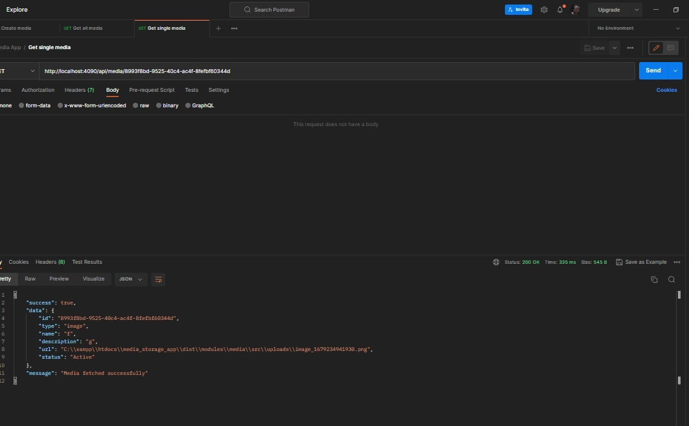
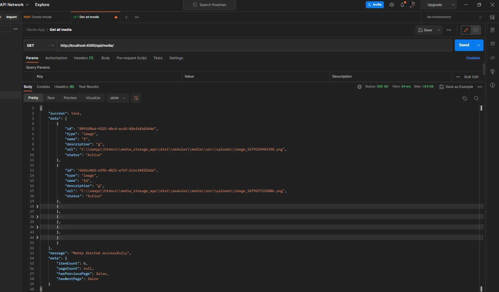
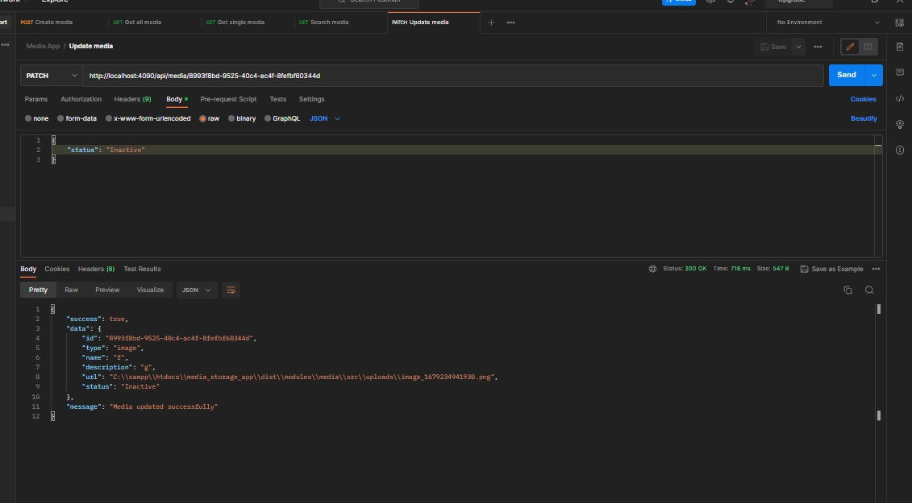

# NESTJS CRUD APP FOR MEDIA STORAGE
This is a simple CRUD API for media storage powered by Nodejs, Nestjs and TS

## Requirements
- NodeJS runtime
- NPM or Yarn package manager
- Postgres Database

## Features
- Completely written in [Typescript](https://typescriptlang.org/)
- [Nestjs](https://github.com/nestjs/nest) Nodejs framework
- [PostgreSQL](https://www.postgresql.org/docs/) Open Source Relational Database
- [TypeORM](https://typeorm.io/) SQL ORM for Nodejs

## How to install
- Clone the repository
- `git clone https://github.com/OjerIsaac/media_storage_app.git`
- `cd media_storage_app`
- Install dependencies
- `npm install`
- Setup environment variable
- `cp .env.sample .env`
- Run migration
- `npm run db:migrate`
- Run the server in dev env
- `npm run start:dev`

## Documentation.

### Create media

  

### Fetch single media

  

### Fetch all media

  

### Update media

  

